# Netflix Movies and TV Shows — End-to-End Data Analysis

[]()
[]()
[]()

> A polished, interview-ready portfolio project that explores Netflix's public catalogue
> of **8,807 titles** across 122 countries and 42 genres — cleaning the data, answering
> 15 business questions with rich visuals, and packaging everything into an interactive
> Streamlit dashboard.

**Author:** Neethu Reddy Singireddy

---

## Project Overview
Netflix is one of the world's largest streaming services with thousands of Movies and TV
Shows. Content, marketing and localisation teams need to understand *what's in the
catalogue, how it evolved, and where the gaps are*. This project takes the raw Kaggle
`netflix_titles.csv`, applies a real-world analytics workflow, and answers 15 concrete
business questions — from "what genres dominate?" to "which months are content
troughs?".

## Dataset
* **Source:** [Netflix Movies and TV Shows on Kaggle](https://www.kaggle.com/datasets/shivamb/netflix-shows) (mirrored on Zenodo).
* **Shape:** 8,807 rows × 12 columns.
* **File:** [`data/netflix_titles.csv`](data/netflix_titles.csv)

| Column | Description |
|---|---|
| `show_id` | Unique ID |
| `type` | Movie or TV Show |
| `title` | Name of the title |
| `director`, `cast` | People involved |
| `country` | Country of production (may be multi-valued) |
| `date_added` | Date title was added to Netflix |
| `release_year` | Original release year |
| `rating` | TV/Film rating |
| `duration` | Minutes (movies) or seasons (TV) |
| `listed_in` | Genres (multi-valued) |
| `description` | Short synopsis |

## Objectives
1. Clean and standardise a messy real-world dataset.
2. Engineer features that unlock time-series and multi-value analytics.
3. Answer 15 business questions with Python + Pandas.
4. Communicate findings through professional Matplotlib / Seaborn / Plotly visuals.
5. Deliver an interactive Streamlit dashboard for non-technical stakeholders.

## Tools Used
* **Python 3.11**
* **pandas**, **numpy** — data wrangling
* **matplotlib**, **seaborn** — static charts
* **plotly** — interactive charts
* **missingno** — missing-value visualisation
* **Jupyter Notebook** — narrative EDA
* **Streamlit** — interactive dashboard

## Workflow
1. **Load & Inspect** — shape, dtypes, missing values.
2. **Clean** — rename, standardise text, handle missing values, drop duplicates.
3. **Engineer** — parse `date_added`, split multi-value columns, extract minutes/seasons.
4. **Analyse** — 15 business questions, each with code + interpretation.
5. **Visualise** — 11+ chart types (bar, pie, hist, box, heatmap, line, stacked bar…).
6. **Summarise** — business insights + executive dashboard.

## Key Insights
1. **Movies dominate** the catalogue with a stable ~70/30 split vs TV Shows.
2. **US + India + UK produce >50%** of titles — heavy geographic concentration.
3. **TV-MA is the #1 rating** — Netflix is an adult-skewing platform.
4. **2019 was peak year** for content additions; growth has plateaued since.
5. **International Movies and Dramas are the fastest-growing genres** — Netflix's globalisation bet is real.
6. **Most TV shows have just 1 season** — long-running hits are rare and valuable.
7. **February is the seasonal trough** for content adds — a launch-calendar opportunity.
8. **Average movie ≈ 99 minutes** — Netflix optimises for a single evening's viewing.

## Sample Visualisations

| | |
|---|---|
| 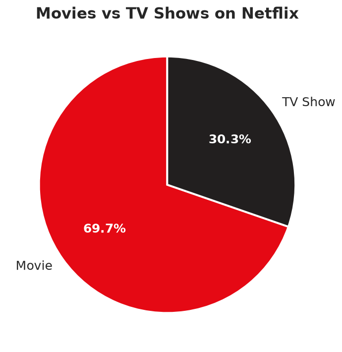 | 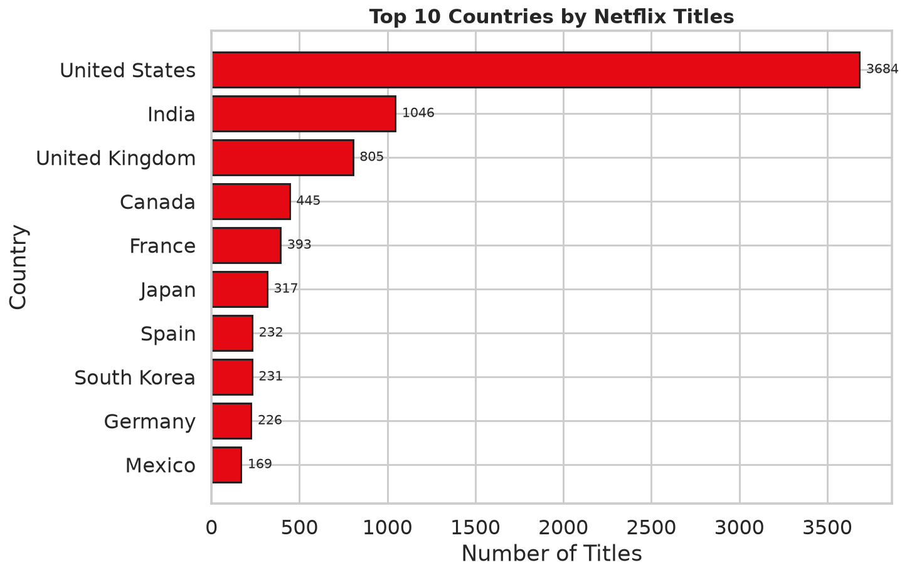 |
| 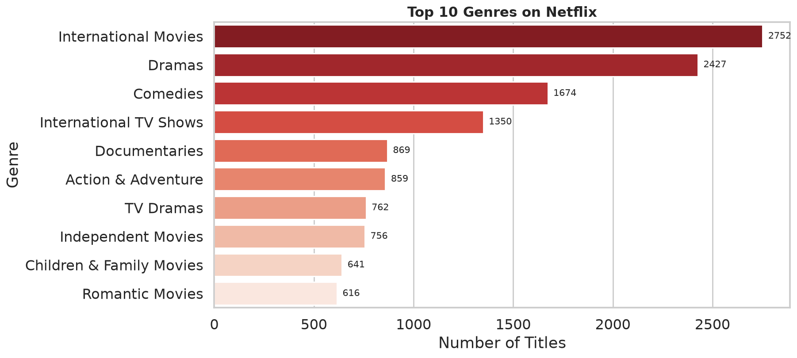 | 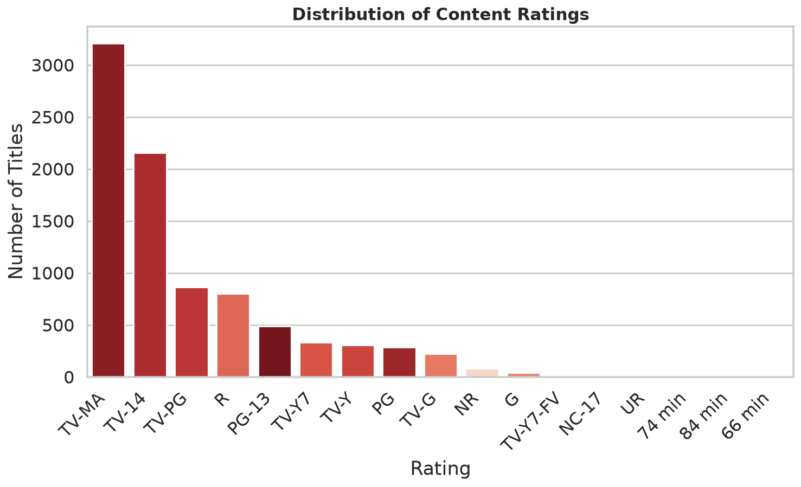 |
| 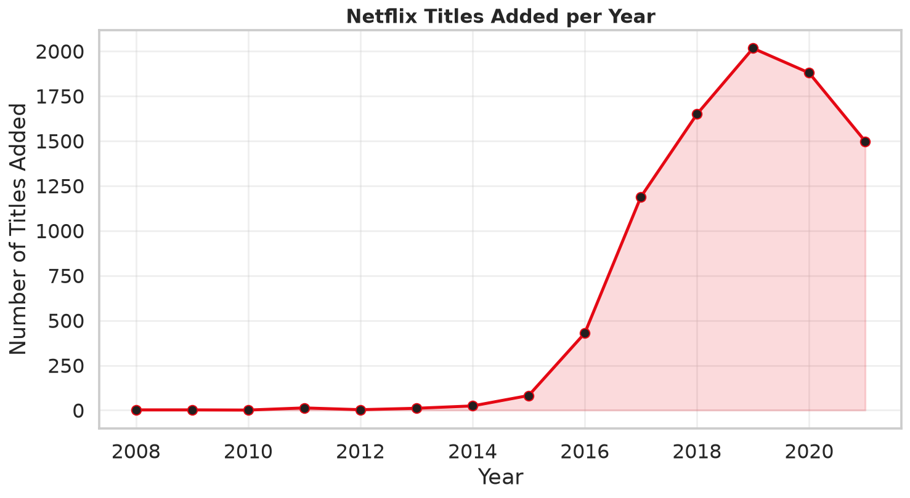 | 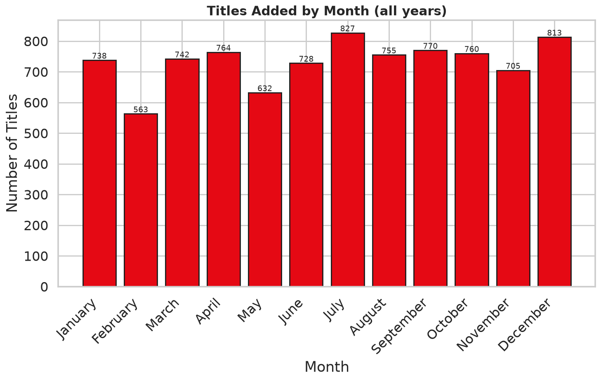 |
| 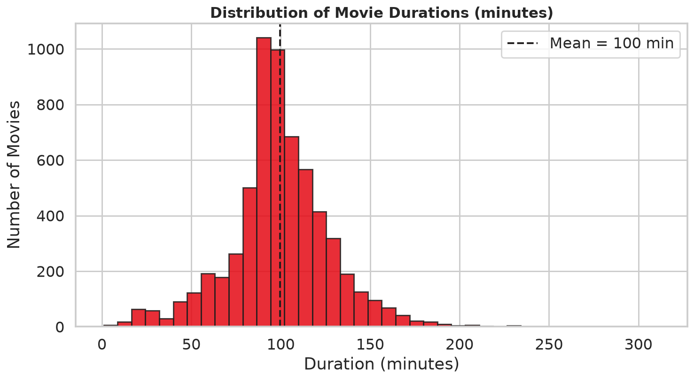 | 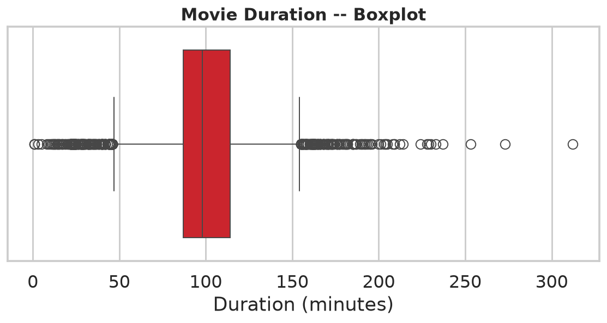 |
| 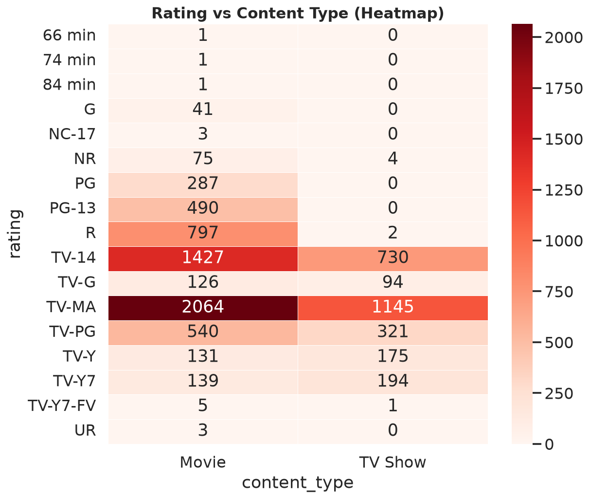 | 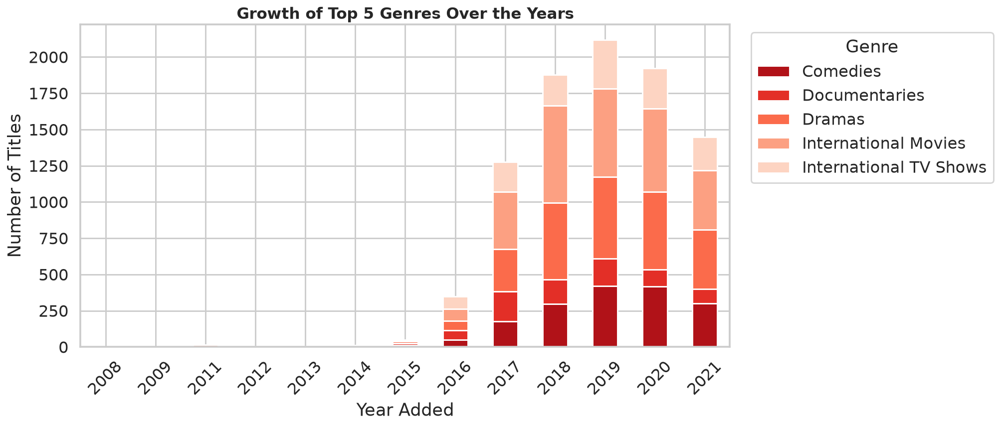 |
| 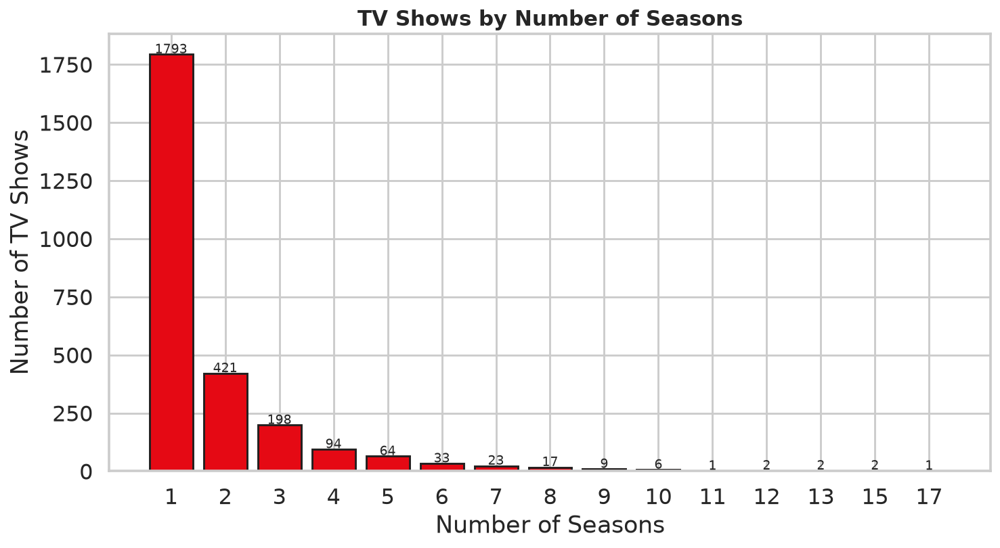 | |

## Project Structure
```
Netflix-Data-Analysis/
├── data/
│   └── netflix_titles.csv         # Raw dataset (8,807 rows)
├── notebooks/
│   └── Netflix_EDA.ipynb          # Full narrative EDA (executed with outputs)
├── images/                        # All chart PNGs rendered from the notebook
├── src/
│   ├── __init__.py
│   ├── cleaning.py                # Data-cleaning pipeline
│   ├── analysis.py                # Business-question functions
│   └── visualization.py           # Matplotlib/Seaborn chart builders
├── docs/
│   ├── interview_questions.md     # 25+ likely interview questions with answers
│   ├── resume_bullets.md          # Copy-paste bullet points for CV
│   ├── github_description.md      # Short GitHub project description
│   └── linkedin_description.md    # LinkedIn "Projects" section text
├── dashboard.py                   # Streamlit interactive dashboard
├── requirements.txt
└── README.md
```

## Installation
```bash
git clone https://github.com/neethu18reddy/Netflix-Data-Analysis.git
cd Netflix-Data-Analysis
python -m venv .venv && source .venv/bin/activate   # or .venv\Scripts\activate on Windows
pip install -r requirements.txt
```

## How to Run

### 1. Explore the notebook
```bash
jupyter notebook notebooks/Netflix_EDA.ipynb
```
The notebook is pre-executed — every chart and insight renders on open.

### 2. Regenerate all chart PNGs
```bash
python -c "from src.cleaning import clean_pipeline; from src import visualization as v; \
           v.render_all(clean_pipeline('data/netflix_titles.csv'))"
```

### 3. Launch the interactive dashboard
```bash
streamlit run dashboard.py
```
Then open <http://localhost:8501>.

## Future Work
* Merge with **IMDb ratings** and TMDb popularity scores to weight insights by quality.
* Add **NLP topic modelling** on the `description` column to discover latent genre clusters.
* Predict "will this be added" with a classification model.
* Forecast monthly additions with a time-series model (Prophet / SARIMA).
* Deploy the Streamlit dashboard publicly on Streamlit Cloud.

## Author
**Neethu Reddy Singireddy**  
Aspiring Data Analyst — Python | SQL | Pandas | Storytelling

- GitHub: [@neethu18reddy](https://github.com/neethu18reddy)
- LinkedIn: [Neethu Reddy Singireddy](https://www.linkedin.com/in/neethu-reddy-singireddy-425802369/)
- Email: [sneethureddy18@gmail.com](mailto:sneethureddy18@gmail.com)

> Feel free to open an issue or reach out if you have suggestions or want to collaborate.
